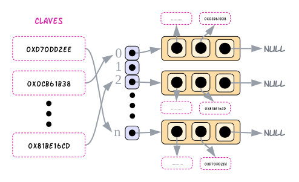

<div align="right">

</div>

# TDA HASH

## Repositorio de Francisco Infanti - 110822 - finfanti@fi.uba.ar

- Para compilar:

```bash
make pruebas_chanutron 
```

- Para ejecutar:

```bash
./pruebas_chanutron 
```

- Para ejecutar con valgrind:
```bash
make valgrind-chanutron
```
---
##  Funcionamiento
El programa consiste en la implementación de un diccionario mediante una `tabla de hash` de tipo `abierta` con direccionamiento `cerrado`.

La implementación que se usa para crear la tabla de hash consiste de dos estructuras:
- Una principal, `struct hash`, la cual almacena el tamaño de la tabla, la cantidad de espacio que se usa y un array de punteros. En cada posición de dicho array se apunta a un `struct nodo`, que vendría a ser la segunda estructura.
- La segunda estructura, `struct nodo`, almacena la dirección de memoria del valor que se está guardando, una copia de la clave y la dirección de memoria del siguiente nodo.

---
<div align="center">

<div>Representación de cómo se vería aproximadamente el heap</div>
</div>

---
En esta implementación, al ser un `hash abierto`, se posicionan a las colisiones en las posiciones que les corresponde. Por lo tanto se hace uso del puntero al siguiente que hay en cada nodo, para ir encadenando las colisiones a medida que ocurren. En el caso de que no haya colisiones dicho nodo apuntaría a `NULL`.

La función de hash que se utiliza es ***djb2***, esta recibe un string y lo transforma en un número aleatorio. Para que dicho número se mantenga dentro del rango de posiciones del array, se usa el operador modulo. Es decir, si $n$ es número que devuelve ***djb2***, $P_S = n$ % $m$, siendo $m$ el tamaño de la tabla, devuelve la posición de la tabla donde se debe insertar el elemento.

El usuario puede guardar cualquier tipo de valor en el diccionario, por eso se usan los `void *` los cuales permiten guardar direcciones de memoria sin necesidad de saber que hay en dichas.

Al usuario se le proporciona una variedad de operaciones las cuales puede utilizar para poder interactuar con el diccionario, por ejemplo: *crear*, *destruir*, *insertar*, *quitar*, *buscar*, *contiene*, *cantidad* y por último un *iterador interno*.

Para poder ***crear*** un hash se reserva un bloque de memoria que pueda almacenar todo lo especificado en `struct hash`. A su vez, dentro de la estructura se reserva un array de punteros a `struct nodo` de tamaño especificado por el usuario, este no puede ser menor a tres. Al finalizar el proceso de reservar memoria e inicializar los campos en sus valores correspondientes se devuelve al usuario un puntero a la estructura principal o `NULL` en caso de error.

*(***COMENTARIO***: Inicialmente todos los valores de los campos de la estructura se inicializan en $0$, menos el campo que almacena el tamaño del array, en ese caso se inicializa con el tamaño que especificó el usuario.)*

Analizando la complejidad de crear un hash, se puede ver que es constante $O(1)$, pues solamente se reservan bloques de memoria en el heap y se inicializan en el valor correspondiente.

---
<div align="center">

<div>Representación de cómo se vería el heap luego de haber sido creado</div>
</div>

---
Una vez creado el hash, se debe destruirlo cuando se termine de usarlo. Para realizar dicha operación se proporcionan dos funciones, ambas liberan la memoria que ocupa el hash, pero con la diferencia de que una aplica una función destructora a cada elemento y la otra no. La forma más sencilla de destruir el hash, es recorrer el array y liberar la memoria de cada nodo que se encuentra en la posición $x$. Una vez se termina de recorrer, se libera el array y por último la estructura principal.

Veamos que la complejidad de destruir un hash siempre va a ser $O(n)$, pues si se almacenan $n$ elementos, se debe liberar la memoria de cada uno de ellos, por lo tanto recorremos $n$ elementos.

---
<div align="center">

<div>Representación de cómo sería el proceso de ir liberando la memoria de cada parte de la estructura</div>
</div>

---
Para utilizar la función de insertar, el usuario debe proporcionar el hash, una clave, el valor que desea guardar y, si quiere, un doble puntero a `void`. En esta implementación si la clave ya existe, lo que se hace es actualizar el valor del nodo que contenga dicha clave por el nuevo valor pasado. Si el usuario proporcionó el doble puntero a `void`, se le devuelve a través de este el valor anterior que tenía el nodo, ahora si no se intercambio nada se le devolverá `NULL`.

Entonces para insertar un nuevo valor se hashea la clave usando la función ***djb2*** a una posición válida del array. Una vez se tiene dicha posición se debe verificar que en esta posición no exista un nodo con esa clave, por lo tanto se recorre todas las colisiones que hay en esa posición (si es que las hay) y se verifica si alguna clave coincide con la recibida. En el caso de que ya exista, como dije antes, se actualiza el valor. Ahora en caso de no existir, se crea un nuevo nodo con una copia de la clave y un valor, y se lo encadena en el primer lugar.

Veamos que la complejidad de insertar un elemento en una tabla de hash es $O(n)$, pues en el peor de los casos se recorre las $n$ colisiones de la $m$ posición del array para determinar que la clave no existe.

---
<div align="center">

<div>Representación de cómo se vería insertar un nuevo elemento que no colisione (es muy similar cuando colisiona) y como se vería si se tendria que actualizar el valor</div>
</div>

---
Por último se calcula el *factor de carga* de la tabla. Dicho valor se calcula como $F_C = \frac{capacidad}{tamaño}$, si $F_C \ge 0.7$, entonces se hace un ***rehash***. En esta implementación hacer un ***rehash*** consiste en agrandar el tamaño del array al doble. Es decir, si el tamaño original era $4$, ahora pasa a ser $8$.

Para hacer esta operación se crea un puntero auxiliar que apunte a la antigua tabla de $n$ posiciones, y se reserva con el puntero del hash un nuevo bloque de memoria de tamaño $2n$. Luego recorriendo la antigua tabla de hash se acomodan los nodos en la nueva tabla, calculando a cada uno de ellos su nueva posición. Finalmente se libera la memoria de la tabla antigua.

La complejidad que tiene el ***rehash*** va a ser $O(n)$, pues se debe recorrer los $n$ elementos de la antigua tabla e ir acomodandolos en la nueva.

---
<div align="center">

<div>Representación de como se veria resumidamente la operación de rehash</div>
</div>

---
Para utilizar la función de eliminar, el usuario debe proporcionar la tabla de hash y la clave del elemento que se desea eliminar. Una vez finalizado el proceso se devuelve el elemento eliminado o `NULL` si no existía o en caso de error,

Para eliminar un elemento se hace hashea la clave a una posición válida del array y pueden ocurrir tres casos:
- Se verifica si existen nodos en dicha posición.
 - En caso de que no, se devuelve `NULL`, pues eso significa que el elemento no existe.
 - Si existe y además está en la primera posición de las colisiones. Entonces se hace que el puntero del array apunte al siguiente de eliminar y se elimina el elemento liberando memoria.
 - Si existe, pero no está en la primera posición, entonces se recorre las colisiones hasta encontrar el nodo anterior al elemento que queremos eliminar o hasta que no haya más nodos. Si ocurre el primer caso, entonces se hace que el anterior apunte al siguiente de eliminar y luego se elimina el elemento. Ahora, si ocurre el segundo caso, se devuelve `NULL`, pues eso significa que no existe el elemento.

Veamos que la complejidad de eliminar un elemento en un hash es $O(n)$, pues en el peor de los casos, cuando se hashea la clave, se obtiene una posición con $n$ colisiones y hay que recorrer todas para determinar que el nodo no existe.

---
<div align="center">

<div>Representación de cómo se vería el proceso de quitar un elemento del hash</div>
</div>

---
Para poder buscar un elemento o saber si existe un elemento con una clave en la tabla de hash, el usuario debe proporcionar la tabla y la clave del elemento que desea buscar. La diferencia entre buscar un elemento o saber si existe esa clave es que uno devuelve un puntero al elemento, si existe, y el otro devuelve true o false, dependiendo de si existe o no.

El proceso que se hace es muy similar, la única diferencia es lo que devuelven. Se hashea la clave dada y se recorren todas las colisiones que haya en esa posición del array. Buscando el nodo que tenga la clave que coincida con la que se pasa por parámetro. En caso de no existir se devuelve `NULL` o false, dependiendo de qué función se esté utilizando.

Veamos que la complejidad de buscar un elemento en una tabla de hash, en el caso promedio es $O(1)$, pues al hashear se obtiene una posición donde se encuentra directamente el elemento buscado. Es cierto que en el peor caso es $O(n)$, pues se deben recorrer $n$ colisiones, pero eso depende de que tan buena sea la función de hash y el uso o no de un ***rehash***.

---
<div align="center">

<div>Por ejemplo, busco el valor con la clave 0x74b1d29a, si la hasheo con djb2 me da la posicion 2, entonces uso el puntero en la posicion 2 del array para ir a donde esta apuntando y vemos que existe el elemento</div>
<div>Podria haber tomado la clave 0xd70dd2ee y vemos que nos da la posicion 4, pero como ahi no hay nada, entonces no existe</div>
</div>

---
Para determinar la cantidad de elementos que hay en la tabla de hash se puede usar una función que devuelve un valor al cual se tiene una referencia directa desde la estructura `struct hash`. Por lo tanto es por eso que esta operación tiene complejidad constante $O(1)$.

El iterador interno le permite al usuario recorrer los elementos que él quiera, este funciona pasándole la tabla de hash, una función de tipo bool y un auxiliar, si se quiere. La función se le aplica a cada elemento del hash hasta que devuelva false. Finalmente se devuelve la cantidad de elementos a los cuales se les aplica la función. La complejidad de esto es $O(n)$, pues en el peor de los casos se recorren los $n$ elementos de la tabla.

## Respuestas a las preguntas teóricas
Un diccionario es una colección de pares, un par está conformado por dos partes:
- El `valor:` es lo que se quiere almacenar en el diccionario.
- La `clave:` esta debe ser única, pues se va a utilizar como un índice para acceder a un dato.

El motivo por el cual usamos diccionarios es porque estos mejoran el tiempo de acceso a un elemento. Es decir, veamos en el caso de las **lista**, el acceso a un dato tiene una complejidad lineal $O(n)$. En el caso de los **ABB** (suponiendo que está balanceado), la complejidad sería $O(log(n))$. Pero en el caso de los diccionarios, se busca optimizar esta operación a tal punto de que la complejidad, en el caso promedio, sea $O(1)$. Entonces buscar un elemento en un diccionario con $n$ elementos sería algo casi instantáneo.
 
### Tablas de Hash
Una posible forma de implementar los diccionarios es con ***Tablas de Hash***. Esta, como lo dice el nombre, es una estructura que tiene una forma de una tabla, donde en cada posición de la tabla se almacena un par.

Yo para poder acceder a un elemento de la tabla voy a necesitar la `clave` que está asociada a este elemento. Teniendo mi `clave` voy a tener que aplicarle una `función de hash`.
- Una `función de hash` es una función la cual transforma claves en un número asociado. Una función de hash no puede depender de algo relacionado a la tabla de hash. En nuestro caso, las funciones que vamos a usar van a transformar un string a un número, dicho lo dividiremos por el tamaño de la tabla y usaremos el resto como posición en la tabla.

Una vez tengamos la posición asociada a la clave, debemos verificar si en esa posición está el elemento que buscamos. Si el elemento existe, entonces debe estar en esa posición. Si eso no ocurre, entonces hicimos algo mal.

---
<div align="center">

<div>A cada clave se le asocia una posición donde podemos encontrar tanto el valor como la clave</div>
</div>

---
El problema que ocurre es que yo puedo tener $n$ claves y $m$ posiciones en tabla. Ahora $n$ es un valor que no está acotado, puede tomar valores desde $0$ hasta el infinito. Pero $m$ si es un valor acotado, este depende de la cantidad de espacio que tiene nuestra tabla de hash. Entonces lo que va a ocurrir, sea cual sea la función de hash, es que para $x$ valores de $n$ van a coincidir las posiciones en la tabla de hash. A esto se lo llaman ***Colisiones*** y dependiendo de cómo las resolvamos vamos a estar utilizando un tipo de hash diferente.

---
<div align="center">

</div>

---
- ### Hash Cerrado
  Se dice que cuando un hash es cerrado, este tiene un `direccionamiento abierto`.

  Que un hash sea cerrado significa que los pares deben guardarse dentro de la misma estructura que la tabla. Entonces podríamos pensar que cada posición de la tabla va a almacenar un `valor` y una `clave`, es decir, un par.

  ---
  <div align="center">
  
  <div>Representacion de un hash cerrado</div>
  </div>

  ---
  En este tipo de hash para poder manejar las `colisiones` existen tres formas diferentes:
  - `Probing Lineal:` en este caso lo que hacemos es insertar la colisión en la próxima posición vacía de la tabla. Es decir, nosotros vamos a hashear la clave y veremos que en la posición obtenida ya hay un par. Entonces iremos avanzando por las posiciones de la tabla hasta encontrar una posición libre e insertar el nuevo par.
  - `Probing Cuadrático:` en este caso usaremos la operación (intentos fallidos)² para poder insertar.
      
    - Por ejemplo si nuestra función de hash es $hash(clave)$ % $tamanio$, si encontramos una colisión la primera vez haremos $hash(clave) +1²$ % $tamanio$, la segunda $hash(clave) +2²$ % $tamanio$ y la n-ésima $hash(clave) +n²$ % $tamanio$

  - `Hash Doble:` en este caso, como lo dice el nombre, aplicaremos otro hash diferente hasta encontrar un lugar libre en la tabla.

  Se dice que está hash tiene un `direccionamiento abierto`, porque cuando insertamos un elemento lo estamos insertando en una posición incorrecta.

  ---
  <div align="center">
  
  <div>Como se resolveria una colisión con Probing Lineal</div>
  </div>

  ---  
- ### Hash Abierto
  Se dice que cuando un hash es abierto, este tiene un `direccionamiento cerrado`.

  Se dice que es un hash abierto, porque almacenaremos los pares fuera de la estructura de la tabla, es decir, en cada posicion de la tabla habrá un puntero a una estructura donde se encontrarán los pares, esta estructura pueden ser **nodos**, **listas**, etc...

  ---
  <div align="center">
  
  <div>Representacion de un hash abierto</div>
  </div>

  ---
  Para trabajar con las colisiones lo que haremos es encadenar las colisiones en la estructura. Veamos que no hay problemas, pues si usamos una lista, podemos tener $n$ elementos en esa lista. Entonces nosotros hasheamos la clave, obtenemos la posición y accedemos a la estructura donde debemos buscar el elemento recorriendola.


  Se dice que es un `direccionamiento cerrado`, porque las colisiones las estamos mandando a la posición que les corresponde, solamente que las insertamos en una estructura a parte.

Ahora es lógico pensar que al usar cualquier tipo de hash, la complejidad de busqueda no seria $O(1)$, pues en el peor caso del abierto (si usamos `probing lineal`) debemos recorrer $n$ elementos de la tabla hasta volver a la posición donde estábamos y determinar que la clave no existe. Y en el peor caso del cerrado debemos recorrer la estructura que estemos usando y esta puede también tener $n$ elementos. Ahora la realidad es que en el caso promedio, la complejidad es $O(1)$ y además las colisiones van a depender de qué tan buena sea la función de hash que estamos utilizando. Además para poder mejorar esto, lo que hacemos es llevar la cuenta de un `factor de carga` y que cuando este factor supera cierto valor aumentamos el tamaño de nuestra tabla al doble, triple o lo que sea. A esta operación se la llama ***rehashear*** y lo que hacemos es crear una nueva estructura y hashear cada clave, con la misma función que usamos antes, para volver a insertar todos los elementos. Como el rango de posiciones de la tabla aumentó, entonces aumenta la posibilidad de que las claves no colisionan.